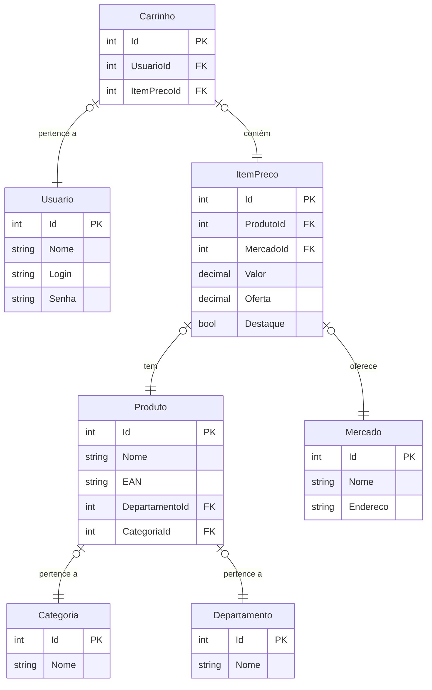

# Documentação banco de dados BetterPrice
![Versão](https://img.shields.io/badge/version-1.0.0-brightgreen

Este documento tem por finalidade descreve a estrutura gerenciamento e manutenção do banco de dados utilizado no projeto _BetterPrice_. 

## Gerenciador de banco de dados

O PostgreSQL foi escolhido para armazenar os dados desta aplicação devido à sua alta escalabilidade, tanto vertical quanto horizontal. Ele oferece flexibilidade para ser utilizado como banco de dados relacional e não relacional, facilitando a transição entre esses dois modelos de dados conforme necessário. Além disso, sendo um projeto open source com uma comunidade bastante ativa, proporciona a redução de custos e acesso a uma ampla gama de plugins e extensões. O PostgreSQL também é amplamente reconhecido por seu excelente desempenho em consultas complexas, especialmente aquelas que envolvem grandes conjuntos de dados ou múltiplas junções de tabelas, inclusive em operações com documentos não relacionais, utilizando a tecnologia JSONB.

Inicialmente, o projeto foi planejado para operar exclusivamente com um banco de dados relacional. No entanto, à medida que a base de usuários cresce e o sistema se torna mais escalável, a necessidade de um alto desempenho no processamento de dados se tornará crucial para suportar o volume crescente de requisições e consultas simultâneas. Nesse cenário, a migração para um modelo de dados não relacional será indispensável para garantir a eficiência e capacidade de resposta do sistema e a utilização do PostgreSQL facilitará essa transição.

## Estrutura geral

A estrutura geral do banco de dados é organizada em três tabelas principais que trabalham em conjunto para armazenar e gerenciar dados de produtos, mercados e preços:

- **Tabela de Produtos**: Armazena informações detalhadas sobre cada produto, incluindo sua categoria, preço base, departamento associado e os mercados que o comercializam.
- **Tabela de Preços:** Contém os preços específicos de cada produto em diferentes mercados, permitindo o controle de variações de preços por localização.
- **Tabela de Mercados:** Registra os dados e informações gerais dos mercados, como nome, localização e outros detalhes relevantes.
- **Tabela de Carrinho:** Armazena os itens adicionados ao carrinho pelos usuários, incluindo o produto, a quantidade, o mercado associado e o preço final de cada item no momento da compra.

Essa estrutura facilita a consulta e o gerenciamento de produtos, preços e mercados de forma organizada e eficiente.

## Esquema de Dados

Esquema de Dados
O banco de dados foi projetado de forma relacional, com tabelas que representam as principais entidades e seus relacionamentos. Abaixo estão descritas as principais tabelas e suas colunas.

### **Tabela Carrinho** 
>**id (int):** Chave primária que identifica cada carrinho. 
**usuario_id (int):** Chave estrangeira que referencia a tabela de usuários. 
**itempreco_id (int):** Chave estrangeira que referencia o item de preço (ou seja, o produto com o preço atribuído).

**Relacionamentos:**

Cada carrinho pertence a um único usuário.
Um carrinho pode conter vários produtos (relacionado pela tabela associativa item_preco).

### **Tabela Categoria** 
> **id (int):** Chave primária que identifica cada categoria. 
**nome (varchar):** Nome da categoria.

**Relacionamentos:**

Cada produto está associado a uma única categoria.

### **Tabela Departamento**
> **id (int):** Chave primária que identifica cada departamento. 
**nome (varchar):** Nome do departamento.

**Relacionamentos:**

Cada produto pertence a um único departamento.

### **Tabela ItemPreco**
> **id (int):** Chave primária que identifica cada item de preço. 
**produto_id (int):** Chave estrangeira que referencia a tabela de produtos. 
**mercado_id (int):** Chave estrangeira que referencia a tabela de mercados. 
**valor (decimal):** Preço regular do produto. 
**oferta (decimal):** Preço promocional do produto, se houver. 
**destaque (boolean):** Indica se o item está em destaque no mercado. 

**Relacionamentos:**

Um item de preço está vinculado a um único produto e a um único mercado.
O item pode aparecer em vários carrinhos por meio da relação com a tabela carrinho.

### **Tabela Mercado**
> **id (int):** Chave primária que identifica cada mercado. 
**nome (varchar):** Nome do mercado. 
**endereco (varchar):** Endereço do mercado. 
**destaque (boolean):** Indica se o mercado está em destaque. 

**Relacionamentos:**

Um mercado pode ter vários produtos associados por meio da tabela ItemPreco.

### **Tabela Produto**
> **id (int):** Chave primária que identifica cada produto. 
**nome (varchar):** Nome do produto. 
**ean (varchar):** Código de barras do produto (EAN). 
**departamento_id (int):** Chave estrangeira que referencia a tabela de departamentos. 
**categoria_id (int):** Chave estrangeira que referencia a tabela de categorias. 

**Relacionamentos:**

Cada produto pertence a um departamento e a uma categoria.
Um produto pode estar em diversos mercados, através da tabela ItemPreco.

### **Tabela Usuario**

> **id (int):** Chave primária que identifica cada usuário. 
**nome (varchar):** Nome do usuário. 
**login (varchar):** Nome de login do usuário. 
**senha (varchar):** Senha do usuário (armazenada de forma segura, preferencialmente com hash). 

**Relacionamentos:**

Cada usuário pode ter um ou mais carrinhos.

## Diagrama ER

